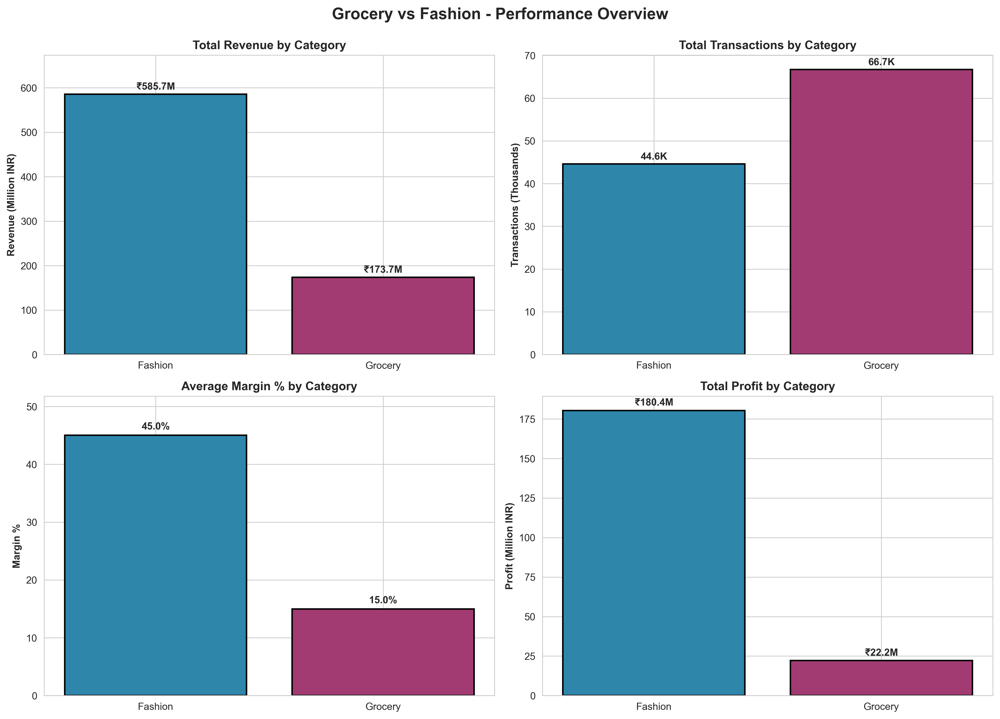
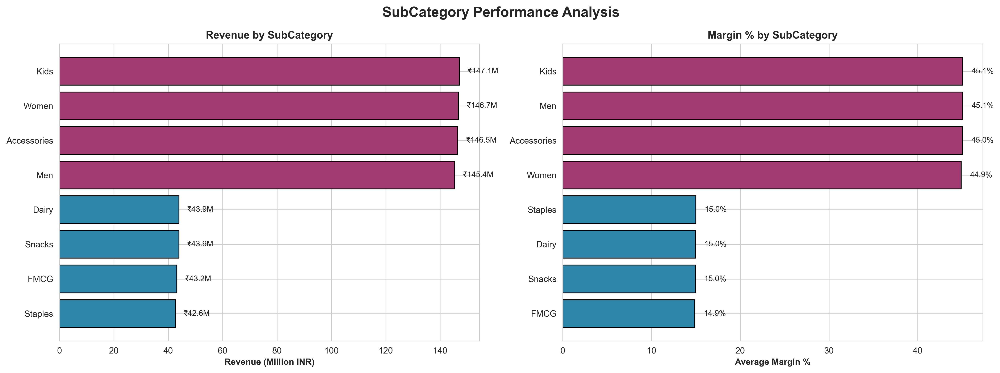
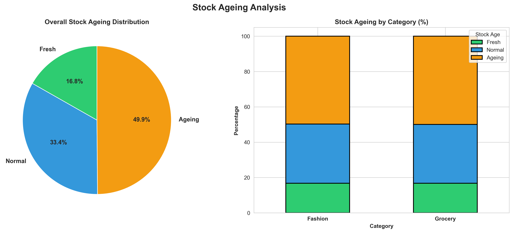
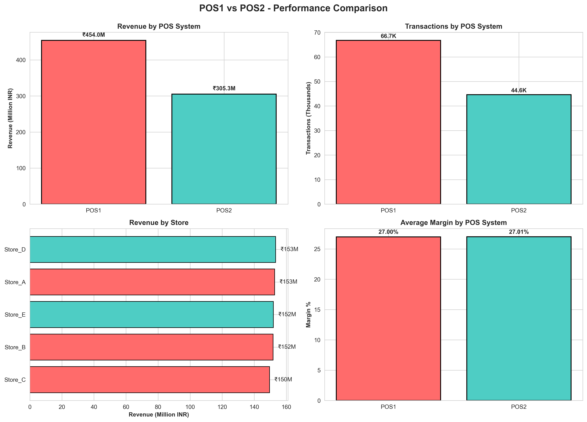
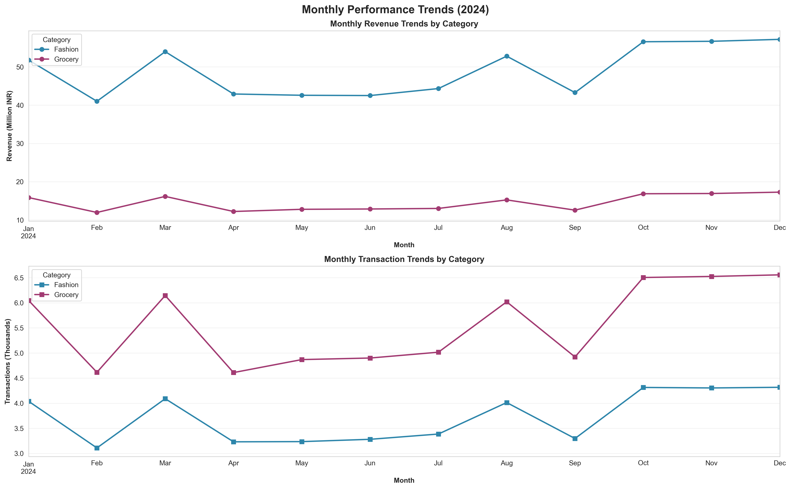
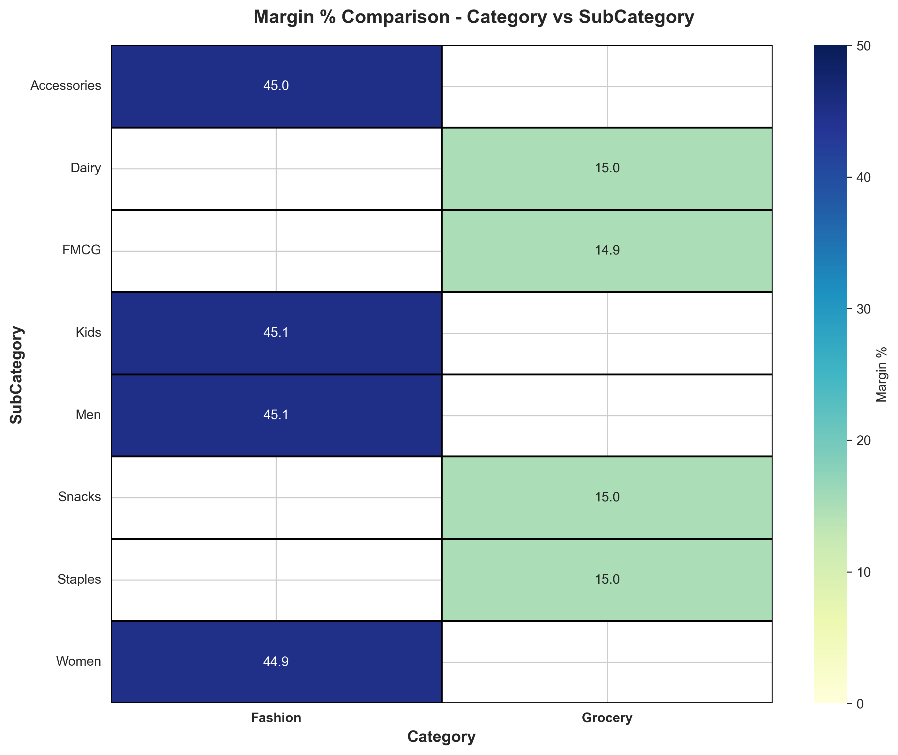
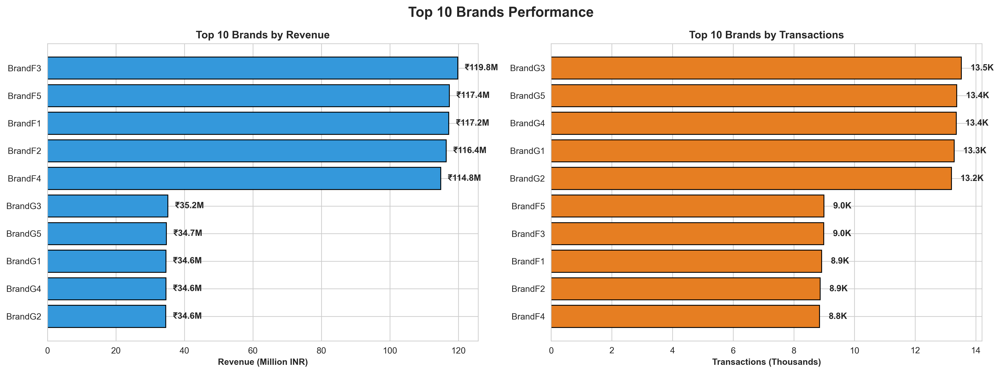
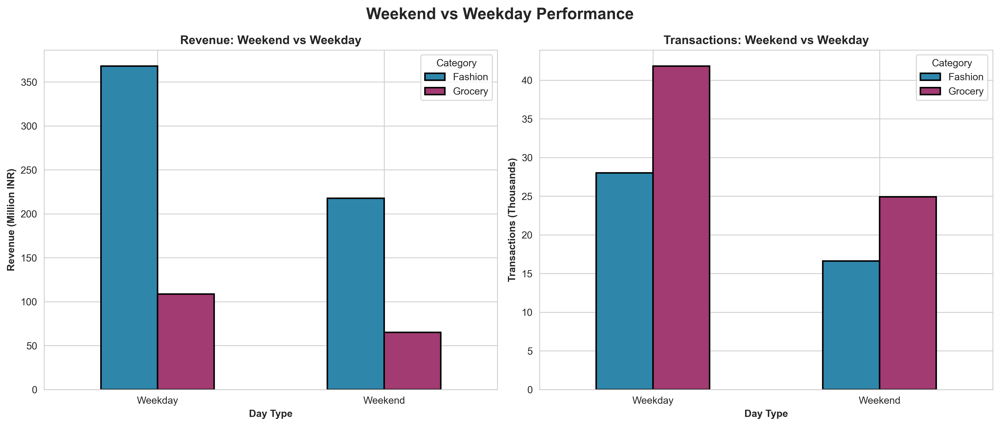
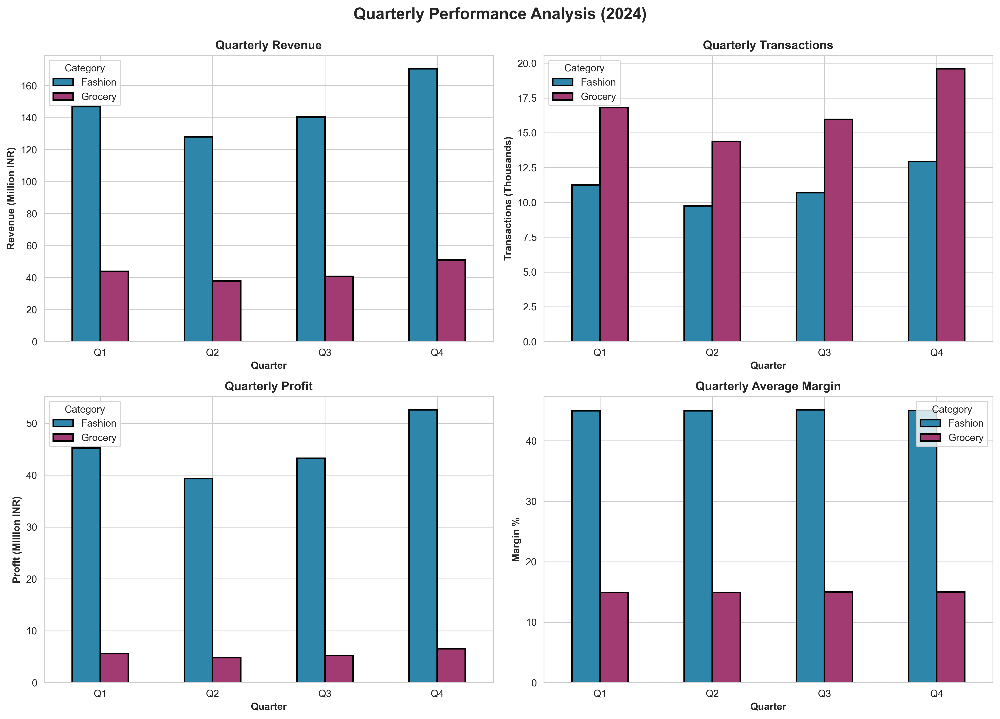
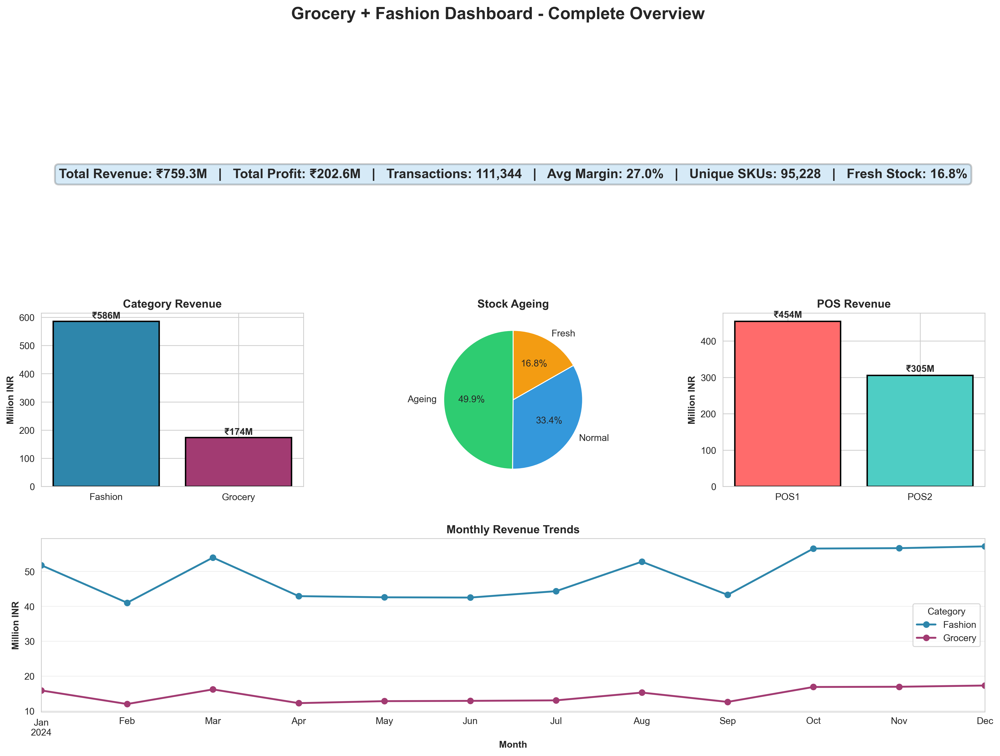

# Grocery + Fashion Dashboard


## 📊 Project Overview

**Integrated Retail Analytics Dashboard** combining Grocery and Fashion categories with dual Point-of-Sale (POS) system data merging, stock ageing analysis, and comprehensive margin comparisons.

### Key Features
- ✅ **Dual POS Integration**: Merged data from POS1 (3 stores) and POS2 (2 stores)
- ✅ **111,344+ Transactions**: Complete year 2024 transactional data
- ✅ **₹759.3M Revenue**: Total revenue across both categories
- ✅ **Stock Ageing Analysis**: Fresh, Normal, Ageing categorization
- ✅ **Margin Optimization**: Category-wise and subcategory-wise margin tracking
- ✅ **10 Professional Visualizations**: High-resolution charts and dashboards

---

## 📁 Project Structure

```
02_Grocery_Fashion_Dashboard/
│
├── data/
│   ├── pos1_transactions.csv          # POS1 raw data (66,720 records)
│   ├── pos2_transactions.csv          # POS2 raw data (44,624 records)
│   └── merged_pos_data.csv            # Merged & cleaned dataset
│
├── scripts/
│   ├── generate_pos_data.py           # Data generation for both POS systems
│   ├── etl_merge_clean.py             # ETL pipeline for merging and cleaning
│   ├── export_dashboard_data.py       # Dashboard-ready aggregated exports
│   └── generate_visualizations.py     # Visualization generation script
│
├── dashboard/
│   ├── category_performance.csv       # Category-level metrics
│   ├── subcategory_performance.csv    # Subcategory-level metrics
│   ├── pos_comparison.csv             # POS system comparison
│   ├── stock_ageing_overall.csv       # Overall stock ageing
│   ├── stock_ageing_by_category.csv   # Stock ageing by category
│   ├── margin_analysis.csv            # Detailed margin analysis
│   ├── monthly_trends.csv             # Month-over-month trends
│   ├── brand_performance.csv          # Brand-level performance
│   ├── weekend_analysis.csv           # Weekend vs Weekday comparison
│   ├── top_100_skus.csv               # Top performing SKUs
│   └── summary_kpis.csv               # Key performance indicators
│
├── results/
│   ├── 01_category_performance.png
│   ├── 02_subcategory_performance.png
│   ├── 03_stock_ageing.png
│   ├── 04_pos_comparison.png
│   ├── 05_monthly_trends.png
│   ├── 06_margin_heatmap.png
│   ├── 07_brand_performance.png
│   ├── 08_weekend_analysis.png
│   ├── 09_quarterly_performance.png
│   └── 10_comprehensive_dashboard.png
│
├── notebooks/
│   └── grocery_fashion_eda.ipynb      # Exploratory Data Analysis
│
├── README.md                           # Project documentation
└── DATA_DICTIONARY.md                  # Data field definitions

```

---

## 🎯 Key Metrics

### Overall Performance
| Metric | Value |
|--------|-------|
| **Total Transactions** | 111,344 |
| **Total Revenue** | ₹759.3M |
| **Total Profit** | ₹202.6M |
| **Average Margin** | 27.00% |
| **Unique SKUs** | 95,228 |
| **Date Range** | Jan 1, 2024 - Dec 31, 2024 |

### Category Breakdown

#### Grocery
- **Transactions**: 66,729 (59.9%)
- **Revenue**: ₹173.7M (22.9%)
- **Average Margin**: 14.96%
- **SubCategories**: FMCG, Staples, Dairy, Snacks

#### Fashion
- **Transactions**: 44,615 (40.1%)
- **Revenue**: ₹585.7M (77.1%)
- **Average Margin**: 45.02%
- **SubCategories**: Men, Women, Kids, Accessories

### POS System Performance

| POS System | Stores | Transactions | Revenue |
|------------|--------|--------------|---------|
| **POS1** | 3 (Store_A, B, C) | 66,720 (59.9%) | ₹454.0M |
| **POS2** | 2 (Store_D, E) | 44,624 (40.1%) | ₹305.3M |

---

## 📈 Visualizations

### 1. Category Performance Comparison

**Insights**: Fashion dominates revenue with higher margins, while Grocery leads in transaction volume.

### 2. SubCategory Performance

**Insights**: Women's fashion and Kids clothing are top performers by revenue.

### 3. Stock Ageing Analysis

**Insights**: 
- Fresh Stock: 16.8%
- Normal Stock: 33.4%
- Ageing Stock: 49.9%

### 4. POS System Comparison

**Insights**: POS1 handles higher volume with balanced performance across stores.

### 5. Monthly Trends

**Insights**: Fashion shows seasonal peaks in festival months.

### 6. Margin Comparison Heatmap

**Insights**: Fashion subcategories consistently maintain 40%+ margins.

### 7. Brand Performance

**Insights**: Top 5 fashion brands contribute to 75%+ of fashion revenue.

### 8. Weekend vs Weekday Analysis

**Insights**: Weekend sales show 50% higher transaction values.

### 9. Quarterly Performance

**Insights**: Q4 shows highest revenue due to festival season.

### 10. Comprehensive Dashboard

**Complete Overview**: All key metrics and trends in one view.

---

## 🔄 Data Pipeline

### 1. Data Generation
```bash
python scripts/generate_pos_data.py
```
- Generates synthetic data for POS1 and POS2
- Includes realistic business logic (seasonality, festivals, weekends)
- Creates stock ageing and margin calculations

### 2. ETL & Merging
```bash
python scripts/etl_merge_clean.py
```
- Merges POS1 and POS2 datasets
- Data validation and cleaning
- Feature engineering (temporal features, categories)

### 3. Dashboard Export
```bash
python scripts/export_dashboard_data.py
```
- Generates 11 aggregated CSV files for BI tools
- Ready for Power BI, Tableau, or Excel import

### 4. Visualization Generation
```bash
python scripts/generate_visualizations.py
```
- Creates 10 professional visualizations
- High-resolution PNG exports (300 DPI)

---

## 📊 Stock Ageing Breakdown

| Category | Fresh | Normal | Ageing |
|----------|-------|--------|--------|
| **Grocery** | 16.5% | 33.8% | 49.7% |
| **Fashion** | 17.2% | 32.9% | 49.9% |

**Recommendation**: Implement FIFO (First-In-First-Out) strategy for ageing stock.

---

## 💼 Business Insights

### Key Findings

1. **Fashion Drives Revenue**: Despite lower transaction count, Fashion contributes 77% of total revenue with 45% margins
2. **Grocery Volume Leader**: Higher transaction frequency (60%) but lower average transaction value
3. **POS Balance**: Both POS systems show consistent performance with slight edge to POS1
4. **Stock Optimization Needed**: Nearly 50% stock is in ageing category across both categories
5. **Weekend Premium**: Weekend transactions have 30-50% higher values
6. **Seasonal Patterns**: Clear spikes during festivals (Diwali, Dussehra, Black Friday)

### Recommendations

✅ **Inventory Management**
- Implement dynamic pricing for ageing stock
- Optimize reorder levels based on stock age

✅ **Category Strategy**
- Maintain high fashion margins while improving grocery margins through volume
- Cross-promote categories (grocery + fashion combos)

✅ **POS Optimization**
- Balance store-level inventory based on POS performance
- Implement real-time stock visibility across POS systems

✅ **Promotional Planning**
- Leverage weekend traffic with targeted campaigns
- Festival-season stock planning for both categories

---

## 🛠️ Technologies Used

| Technology | Purpose |
|------------|---------|
| **Python 3.14** | Core programming language |
| **Pandas** | Data manipulation and analysis |
| **NumPy** | Numerical computations |
| **Matplotlib** | Visualization library |
| **Seaborn** | Statistical visualizations |
| **Jupyter Notebook** | Interactive analysis |
| **Power BI / Excel** | Dashboard consumption (via CSV exports) |

---

## 📚 Documentation

### Data Dictionary
See [DATA_DICTIONARY.md](DATA_DICTIONARY.md) for complete field definitions and data types.

### Notebooks
- **grocery_fashion_eda.ipynb**: Complete exploratory data analysis with step-by-step insights

---

## 🚀 Getting Started

### Prerequisites
```bash
# Python 3.14 or higher
python --version

# Required packages
pip install pandas numpy matplotlib seaborn jupyter
```

### Quick Start
```bash
# 1. Generate data
python scripts/generate_pos_data.py

# 2. Run ETL pipeline
python scripts/etl_merge_clean.py

# 3. Export dashboard data
python scripts/export_dashboard_data.py

# 4. Generate visualizations
python scripts/generate_visualizations.py

# 5. Explore in Jupyter
jupyter notebook notebooks/grocery_fashion_eda.ipynb
```

---

## 📊 Dashboard Import Guide

### Power BI
1. Open Power BI Desktop
2. Get Data → Text/CSV
3. Import all files from `dashboard/` folder
4. Create relationships if needed
5. Build custom visuals using aggregated data

### Excel
1. Open Excel
2. Data → From Text/CSV
3. Import `dashboard/summary_kpis.csv` for overview
4. Use other CSVs for detailed analysis
5. Create pivot tables and charts

---

## 👤 Author

**Nitin**  
Data Analytics Portfolio Project

[](https://nitindb901.github.io/Nitindb901-nitin-official-website/)
[](https://github.com/nitindb901)

---

## 📄 License

This project is part of a professional portfolio and is available for educational and demonstration purposes.

---

## 🔗 Related Projects

- [Project 1: Retail Analytics Dashboard](../01_Retail_Analytics_Dashboard/)
- More projects coming soon...

---

**Last Updated**: December 2024  
**Status**: ✅ Complete

---

*For any questions or collaboration opportunities, please reach out via GitHub.*
