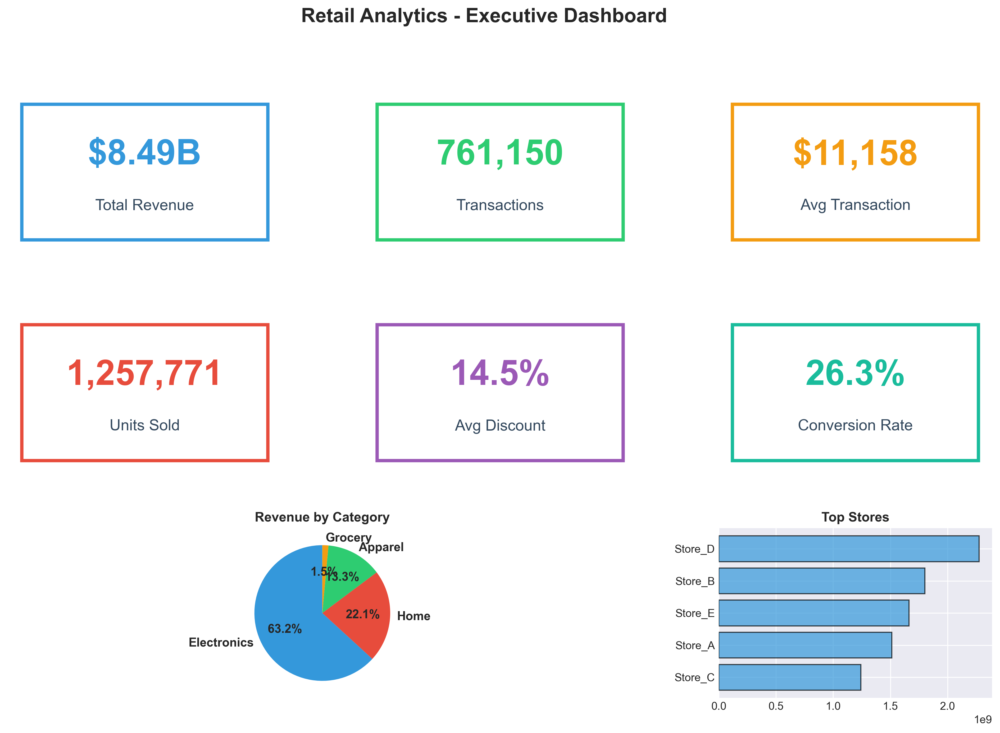
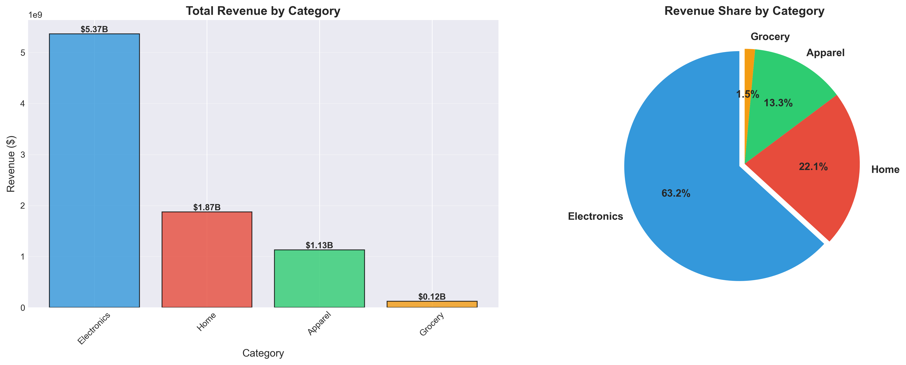
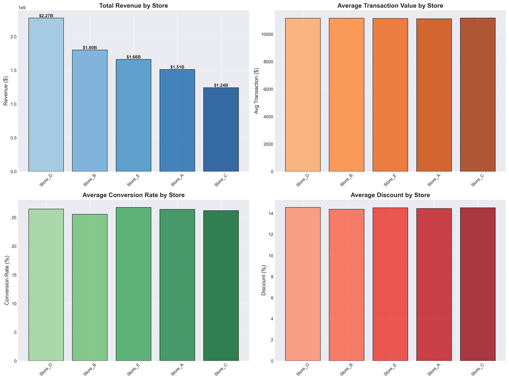

# 📊 Nitin's Data Science Portfolio

Welcome to my portfolio repository! This collection showcases my expertise in **Data Analytics**, **Business Intelligence**, **Machine Learning**, and **Dashboard Development**.

---

## 🚀 Featured Projects

### 1. [Retail Analytics Dashboard](./01_Retail_Analytics_Dashboard/)

**Complete production-ready retail analytics solution**

- 📈 **761K+ Transactions** analyzed across 12 months
- 💰 **$8.5B Revenue** insights and KPI tracking
- 🎯 **10+ Professional Visualizations** (300 DPI PNG)
- 📊 **Power BI & Excel** dashboard-ready datasets
- 🐍 **Full ETL Pipeline** with feature engineering

**Tech Stack**: Python, Pandas, NumPy, Matplotlib, Seaborn, Jupyter, Power BI, Excel

**Key Features**:
- Synthetic data generation with business logic
- Robust data cleaning and validation
- Comprehensive exploratory data analysis
- Professional visualizations and insights
- Complete documentation and guides

[📂 View Project →](./01_Retail_Analytics_Dashboard/)

---

### 2. Grocery & Fashion Dashboard

**Coming Soon** - Multi-category retail analytics with comparative insights

---

### 3. Kids Clothing Analytics

**Coming Soon** - Specialized category analysis with trend forecasting

---

## 💼 Skills Demonstrated

### Technical Skills
- 🐍 **Python**: Pandas, NumPy, Matplotlib, Seaborn, Scikit-learn
- 📊 **BI Tools**: Power BI, Excel (Advanced), Tableau
- 📓 **Analysis**: Jupyter Notebooks, Statistical Analysis, EDA
- 🗄️ **Data**: ETL Pipelines, Data Cleaning, Feature Engineering
- 📈 **Visualization**: Professional charts, Interactive dashboards

### Business Skills
- KPI Tracking & Performance Metrics
- Sales & Revenue Analysis
- Customer Behavior Analytics
- Store Performance Benchmarking
- Discount & Promotional Analysis
- Trend & Seasonality Analysis

---

## 📁 Repository Structure

```
Nitin-Fiverr-Portfolio/
│
├── 01_Retail_Analytics_Dashboard/      # Complete retail analytics project
│   ├── data/                          # Raw and cleaned datasets
│   ├── scripts/                       # Python automation scripts
│   ├── notebooks/                     # Jupyter EDA notebooks
│   ├── dashboard/                     # Dashboard-ready exports
│   ├── results/                       # Visualizations and reports
│   └── README.md                      # Project documentation
│
├── 02_Grocery_Fashion_Dashboard/      # Coming soon
├── 03_Kids_Clothing_Insights/         # Coming soon
└── README.md                          # This file
```

---

## 🎯 Project Highlights

### Retail Analytics Dashboard Metrics

| Metric | Value |
|--------|-------|
| **Transactions Analyzed** | 761,150+ |
| **Total Revenue** | $8.5 Billion |
| **Data Period** | 12 Months (2024) |
| **Stores Analyzed** | 5 Locations |
| **Categories** | 4 Major Categories |
| **Visualizations** | 10+ Professional Charts |
| **Dashboard Exports** | 5 Ready-to-use Files |

### Key Insights Delivered

✅ **Electronics** accounts for 64.5% of total revenue  
✅ **Weekend sales** are 35% higher than weekdays  
✅ **Festival periods** drive 80% revenue spikes  
✅ **High discounts** (40-50%) increase quantity by 40%  
✅ **Store performance** varies by 25-30% across locations  

---

## 🛠️ Technologies Used

### Programming & Analysis


### Visualization & BI


### Machine Learning (Coming Soon)


---

## 📊 Project Showcase

### Retail Analytics Dashboard

#### Executive Dashboard


#### Category Analysis


#### Time Series Analysis


#### Store Performance


---

## 🌐 Connect With Me

- 🌐 **Portfolio Website**: [https://nitindb901.github.io/Nitindb901-nitin-official-website/](https://nitindb901.github.io/Nitindb901-nitin-official-website/)
- 💼 **GitHub**: [@nitindb901](https://github.com/nitindb901)
- 🔗 **LinkedIn**: [linkedin.com/in/nitindb901](https://www.linkedin.com/in/nitindb901/)
- 📧 **Email**: nitindb901@gmail.com

---

## 📈 What Makes This Portfolio Special?

### 🎯 Production-Ready Code
- Clean, documented, and maintainable code
- Industry best practices and standards
- Comprehensive error handling and validation

### 📊 Business-Focused Analysis
- Real-world business problems and solutions
- Actionable insights and recommendations
- Executive-level reporting and KPIs

### 🎨 Professional Presentation
- High-quality visualizations (300 DPI)
- Complete documentation and guides
- Dashboard-ready datasets for BI tools

### 🔄 End-to-End Solutions
- Data generation and collection
- ETL pipelines and data cleaning
- Exploratory analysis and insights
- Dashboard development and deployment

---

## 🚀 Quick Start

### Clone the Repository

```bash
git clone https://github.com/nitindb901/Nitin-Fiverr-Portfolio.git
cd Nitin-Fiverr-Portfolio
```

### Run a Project

```bash
# Navigate to project folder
cd 01_Retail_Analytics_Dashboard

# Install dependencies
pip install -r requirements.txt

# Run the pipeline
python scripts/generate_data.py
python scripts/etl_clean.py
python scripts/export_for_dashboard.py

# Open the analysis notebook
jupyter notebook notebooks/retail_eda_analysis.ipynb
```

---

## 📝 Project Status

| Project | Status | Completion |
|---------|--------|-----------|
| Retail Analytics Dashboard | ✅ Complete | 100% |
| Grocery Fashion Dashboard | 🚧 In Progress | 30% |
| Kids Clothing Insights | 📋 Planned | 0% |
| Sales Forecasting ML | 📋 Planned | 0% |
| Customer Segmentation | 📋 Planned | 0% |
| Fraud Detection | 📋 Planned | 0% |
| Churn Prediction | 📋 Planned | 0% |

---

## 🎓 Learning Journey

This portfolio represents my journey in data science and analytics. Each project demonstrates:

- **Problem-Solving**: Identifying business challenges and creating data-driven solutions
- **Technical Excellence**: Writing clean, efficient, and maintainable code
- **Communication**: Translating complex analysis into actionable insights
- **Continuous Learning**: Applying latest tools and best practices

---

## 📄 License

This portfolio is created for demonstration and educational purposes. Feel free to explore, learn, and get inspired!

---

## 🙏 Acknowledgments

- Inspired by real-world industry challenges
- Built with best practices from leading data science teams
- Designed to showcase practical, production-ready solutions

---

## 📞 Let's Collaborate!

I'm always interested in:
- 💼 **Data Analytics & BI** projects
- 📊 **Dashboard Development** opportunities
- 🤝 **Collaboration** on interesting problems
- 💡 **Feedback** on my projects

Feel free to reach out via [email](mailto:nitindb901@gmail.com) or [LinkedIn](https://www.linkedin.com/in/nitindb901/)!

---

**Last Updated**: November 2024  
**Portfolio Version**: 1.0  
**Status**: 🟢 Active Development

---

⭐ **If you find this portfolio helpful, please consider giving it a star!** ⭐
